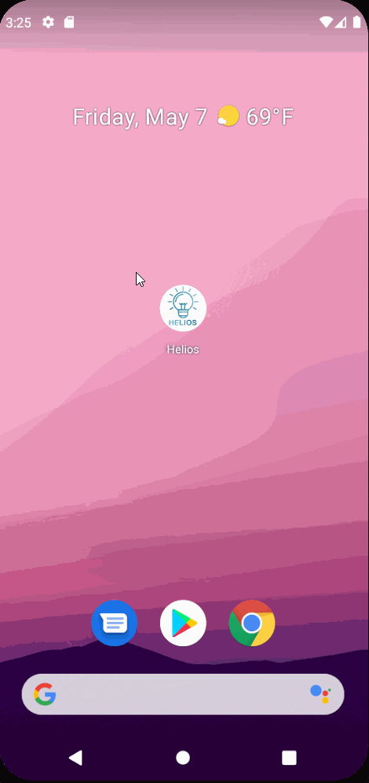

Team Hyperion Codepath Design Project
===

# Helios

## Table of Contents
1. [Overview](#Overview)
1. [Product Spec](#Product-Spec)
1. [Wireframes](#Wireframes)
2. [Schema](#Schema)

## Overview
### Description
Helios is a Philips Hue lighting controller and programming app designed for the Philips Hue wireless LED colour-changing product line. Helios adds the ability for users to create and save their own custom effects.

### App Evaluation
- **Category:** Lifestyle
- **Mobile:** It does not use a lot of mobile features. But this app benefits from the portabilty of small handheld devices enabling the user the freedom to walk around their home as they set and observe lighting effects.
- **Story:** By adding the ability for the user to create their own effects, Helios would offer something that’s not on the market right now. It satisfies a need for a more pro-sumer use of the Philips Hue products.
- **Market:** Currently, this is a niche group. But as the technology (bulbs) become more affordable, we could see a boom of need for an app like this.
- **Habit:** Use is determined by user's needs and would range between multiple times a day to special occasion.
- **Scope:** The scope is three tiered and expandable based on our success. Tier I involves cloning existing functionality which would be well within our abilities. Tier II involves adding new features not available on the market right now. This will require our creativity. There may be a reason those features aren’t available. Tier III involves testing our product and adding new features and polish. This could be very difficult or easy, but we will not know until we get there.

## Product Spec

### 1. User Stories (Required and Optional)

**Required Must-have Stories**

- [X] Login to Hue Account or Connect to Hub
- [X] Accessing list of lights and rooms
- [X] Setting the intensity and color of individual lights

### Video Walkthrough

Here's a walkthrough of implemented user stories:

### 2. Screen Archetypes

- [X] Login Screen
   - [X] Login to Hue Account or Connect to Hub
- [X] Stream
   - [X] Accessing list of lights and rooms
   - [X] Selecting multiple lights and applying effects
   - [X] Selecting rooms and applying effects
- [X] Detail
   - [X] Setting the intensity and color of individual lights

### 3. Navigation

**Tab Navigation** (Tab to Screen)

- [x] Main Stream
- [x] Individual Stream
- [x] Profile/Preset Stream

**Flow Navigation** (Screen to Screen)

- [x] Login
   => Main
- [X] Home
   => Detail Screen

## Wireframes

### [BONUS] Digital Wireframes & Mockups
https://www.figma.com/file/WFAV31QxlxTtGIfSvJjiT0/Untitled?node-id=3%3A155
https://github.com/Codepath-Team-Hyperion/Helios/blob/main/digitalWiredFrame.png

### [BONUS] Interactive Prototype   

## Schema
[This section will be completed in Unit 9]
### Models

#### Model: User
| Property | Type |  Description |
| -------- | -------- | -------- |
| Text     | Text     | Text     |

#### Model: Fixture
| Property | Type |  Description |
| -------- | -------- | -------- |
| uniqueid     | string     | unique identifyer for fixture    |
| on     | boolean     | current state of fixture
| bri     | uint    | current brightness (1-254)
|hue | uint16 | current colour (0-65535)
|sat | uint8 | current saturation (0-254)
|effect | string | current effect

#### Model: Group
| Property | Type |  Description |
| -------- | -------- | -------- |
|name     | string     | name of group
|lights | string array | fixtures in the group
|on | boolean| state of group
|bri|
|hue|
|sat|
|effect|

#### Model: Scenes
| Property | Type |  Description |
| -------- | -------- | -------- |

#### Model: Effect
| Property | Type |  Description |
| -------- | -------- | -------- |
| Text     | Text     | Text     |

### Networking
only using existing APIs

[OPTIONAL:] Existing API Endpoints

Philips Hue API
* Base URL - /api/

|HTTP Verb | Endpoint |Description
| -------- | -------- | -------- |
| GET | /<username>/lights | Get all lights |
|GET |/<username>/lights/<id> | Get light attribute and state
|PUT | /<username>/lights/<id> | Set fixture attribute (rename)
|PUT| /<username>/lights/<id>/state | Set fixture state (on/off, hue, effects)

- [Add list of network requests by screen ]
- [Create basic snippets for each Parse network request]
- [OPTIONAL: List endpoints if using existing API such as Yelp]
